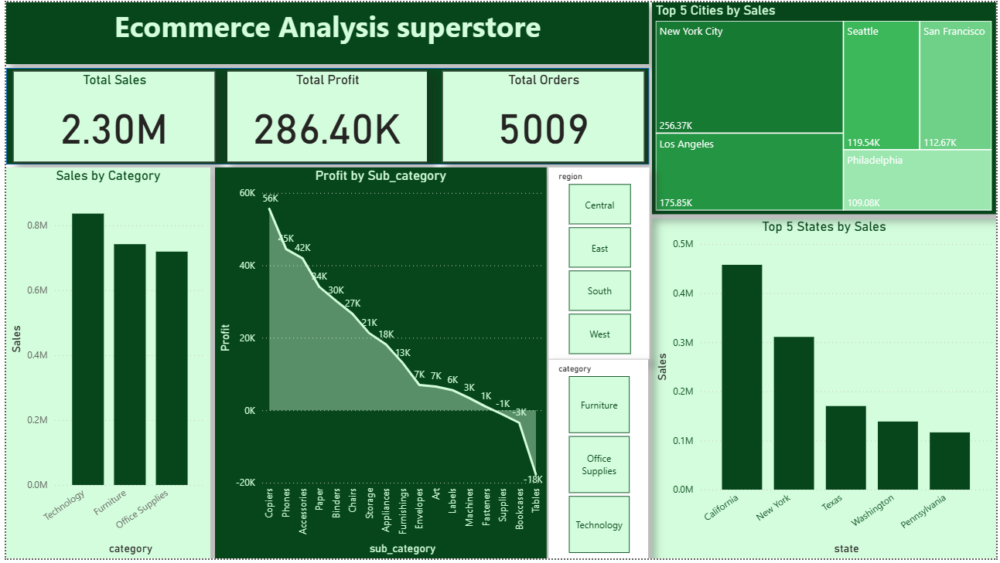

# E-Commerce Sales Analysis Dashboard

## Dashboard Preview

## Project Overview

This project presents an end-to-end sales analytics solution built using MySQL and Power BI. The objective was to analyze e-commerce sales data, generate actionable business insights, and design an interactive dashboard for data-driven decision-making.

---

##  Tools & Technologies

* MySQL
* SQL
* Power BI

---

## Dataset

* Superstore Dataset
* Total Records: 9,994

---

## Project Workflow

CSV Dataset → MySQL Database → SQL Analysis → Power BI Dashboard

---

## Dashboard Features

* KPI Cards (Total Sales, Profit, Orders)
* Top 5 Cities by Sales
* Top 5 States by Sales
* Sales by Category
* Profit by Sub-Category
* Region Filter
* Category Filter

---

## Key Analysis Performed

* Total Sales Analysis
* Total Profit Analysis
* Top Customers by Sales
* Region-wise Sales Analysis
* Category-wise Sales Analysis
* Sub-Category Profit Analysis
* Sales Trend Analysis

---

## Business Insights

* Identified top-performing states and cities
* Compared category-wise sales performance
* Evaluated profit contribution by sub-category
* Enabled interactive exploration through dashboard filters

---

## Skills Demonstrated

* Data Cleaning
* SQL Querying
* Data Analysis
* Business Intelligence
* Data Visualization
* Dashboard Design
* KPI Reporting

---

## Future Improvements

* Add customer segmentation analysis
* Build sales forecasting models
* Automate dashboard refresh using database connections
* Expand analysis with advanced Power BI measures (DAX)

---

## Repository Structure

Dataset/
SQL/
Dashboard/
Screenshots/

---

## Author

Akshay Patel

B.Tech Information Technology

Aspiring Data Scientist | Data Analyst | ML Enthusiast
